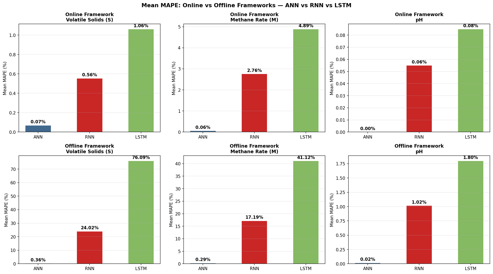
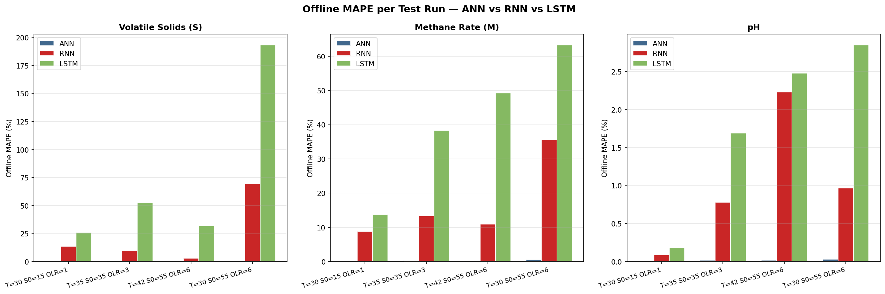
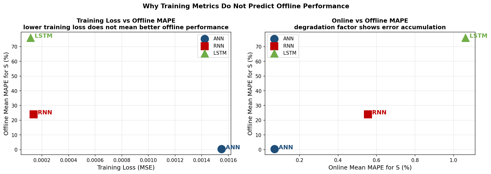
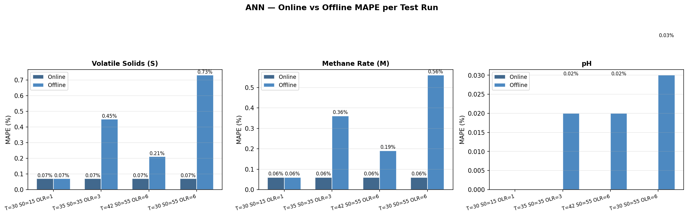

# Modelling of Anaerobic Digestion
### Advanced Business Analytics (DTU)

---

## The Problem

Crete produces roughly half of all European Union olive oil. Every season, hundreds
of mills generate millions of tonnes of toxic liquid and solid byproduct called
olive mill waste. It cannot be spread on land nor discharged into water
and disposal is expensive. One practical solution is anaerobic digestion: bacteria
break down the organic content in the absence of oxygen and produce biogas that
can power the mill itself.

The challenge is that the digestion process is dynamic and non-linear. Three state
variables change over time: volatile solids concentration (how much
organic matter remains), methane production rate (how fast gas is being generated),
and pH (the acidity of the tank, which determines whether the bacteria survive).
Traditional models require many calibrated parameters and are too slow for
real-time use.

This project aims to replace the traditional model with a neural network trained on
simulation data. The network takes the current state of the digester as input and
predicts the rates of change of all 3 variables. The chains those predictions
together with Euler integration gets a 30-day simulation from only
the starting conditions

---

## What This Repo Contains

14 Jupyter notebooks built in PyTorch, covering 3 model types from
data generation through to final comparison.

```
Data_Preparation_Olive_Mill_ipynb.ipynb   ODE simulation, noise augmentation, Excel database
ANN_Training_Olive_Mill.ipynb             First training run
ANN_KFold_Olive_Mill.ipynb                144-combination hyperparameter search
ANN_Retrain_Olive_Mill.ipynb              Retrain with best hyperparameters
ANN_Testing_Olive_Mill.ipynb              Online and offline MAPE evaluation
RNN_Training_Olive_Mill.ipynb             First training run
RNN_KFold_Olive_Mill.ipynb                45-combination hyperparameter search
RNN_Retrain_Olive_Mill.ipynb              Retrain with best hyperparameters
RNN_Testing_Olive_Mill.ipynb              Online and offline MAPE evaluation
LSTM_Training_Olive_Mill.ipynb            First training run
LSTM_KFold_Olive_Mill.ipynb               45-combination hyperparameter search
LSTM_Retrain_Olive_Mill.ipynb             Retrain with best hyperparameters
LSTM_Testing_Olive_Mill.ipynb             Online and offline MAPE evaluation
Comparison_Olive_Mill.ipynb               Final comparison across all three models
```

Run them in the order listed. Each notebook saves its outputs (model weights,
scaler files) to the same folder which ia then used by the next notebook, etc.

---

## The Data

There is no public dataset for this exact process hence training data was generated
by simulating an ODE model of anaerobic digestion calibrated to olive mill waste
using kinetic parameters using published literature.

The simulation covers 36 combinations of operating conditions: 4 temperatures
(30, 35, 38, 42 C), 3 starting substrate concentrations (15, 35, 55 g VS/L)
and 3 organic loading rates (1, 3, 6 g VS/L/day). This produces 1,080 clean
data rows. Each row is replicated 25 times with Gaussian noise to mimic
measurement uncertainty giving 27,000 training rows.

All data is stored in `olive_mill_database.xlsx`, generated by the
data preparation notebook. It contains four sheets: a README, raw simulation
output, a clean reference set for fitting the StandardScaler and the augmented
training set ready for PyTorch

**Kinetic parameter sources:**
Borja et al. (2003), Keating et al. (2016), Federici et al. (2020)

---

## The Models

All 3 models take 5 inputs and predict 3 outputs.

**Inputs:** volatile solids S (g VS/L), methane rate M (mL/L/day), pH,
temperature T (C), organic loading rate OLR (g VS/L/day)

**Outputs:** dS/dt, dM/dt, dpH/dt (rates of change of each state variable)

**ANN**: feedforward network, 2 hidden layers with sigmoid activation, linear
output. Treats each timestep independently. Final architecture: Net(5, 20, 15, 3),
483 parameters

**RNN**: single-layer recurrent network with tanh activation. Takes a sequence
of 12 consecutive timesteps and predicts rates at the last step. Final
architecture: RNNModel(5, 20, 1, 3), 603 parameters

**LSTM**: two-layer LSTM with forget gate, input gate, and output gate. Same
sequence structure as the RNN. Final architecture: LSTMModel(5, 30, 2, 3),
7,083 parameters

Each model goes through the same pipeline in PyTorch: first training run,
K-Fold cross validation to find best hyperparameters, retrain on full dataset,
test in two frameworks

**Online framework:** measured state is given at each timestep. Tests
whether the model learned the kinetics.

**Offline framework:** only day 0 is given. Each prediction becomes input for
the next step via Euler integration over 30 days. This is how the model would
be used in practice

---

## PyTorch Implementation

All models are built from scratch using `nn.Module`. Training uses Adam
optimiser and MSE loss. Hyperparameter search uses K-Fold cross validation
with `deepcopy` to reset weights identically at the start of each combination

```python
class Net(nn.Module):
    def __init__(self, D_in, H1, H2, D_out):
        super(Net, self).__init__()
        self.linear1 = nn.Linear(D_in, H1)
        self.linear2 = nn.Linear(H1, H2)
        self.linear3 = nn.Linear(H2, D_out)

    def forward(self, x):
        x = torch.sigmoid(self.linear1(x))
        x = torch.sigmoid(self.linear2(x))
        x = self.linear3(x)
        return x
```

```python
class RNNModel(nn.Module):
    def __init__(self, input_dim, hidden_dim, layer_dim, output_dim):
        super(RNNModel, self).__init__()
        self.hidden_dim = hidden_dim
        self.layer_dim  = layer_dim
        self.rnn = nn.RNN(input_dim, hidden_dim, layer_dim,
                          batch_first=True, nonlinearity='tanh')
        self.fc  = nn.Linear(hidden_dim, output_dim)

    def forward(self, x):
        h0  = torch.zeros(self.layer_dim, x.size(0), self.hidden_dim)
        out, hn = self.rnn(x, h0.detach())
        return self.fc(out[:, -1, :])
```

```python
class LSTMModel(nn.Module):
    def __init__(self, input_dim, hidden_dim, layer_dim, output_dim):
        super(LSTMModel, self).__init__()
        self.hidden_dim = hidden_dim
        self.layer_dim  = layer_dim
        self.lstm = nn.LSTM(input_dim, hidden_dim, layer_dim, batch_first=True)
        self.fc   = nn.Linear(hidden_dim, output_dim)

    def forward(self, x):
        h0  = torch.zeros(self.layer_dim, x.size(0), self.hidden_dim)
        c0  = torch.zeros(self.layer_dim, x.size(0), self.hidden_dim)
        out, (hn, cn) = self.lstm(x, (h0.detach(), c0.detach()))
        return self.fc(out[:, -1, :])
```
The trained surrogate model is a differentiable approximation of the digestion
process. Once trained, gradient descent can optimise inputs (rather than weights)
to find operating conditions that maximise biogas output which is the main optimisation application of this project

---

## Results

**Training metrics:**

| Model | Parameters | Final Loss | dS R2 | dM R2 | dpH R2 |
|-------|------------|-----------|-------|-------|--------|
| ANN | 483 | 0.001549 | 0.9982 | 0.9984 | 0.9989 |
| RNN | 603 | 0.000138 | 0.9993 | 0.9993 | 0.9977 |
| LSTM | 7083 | 0.000114 | 0.9995 | 0.9995 | 0.9980 |

**Offline framework mean MAPE across four test conditions:**

| Model | Volatile Solids | Methane | pH | Verdict |
|-------|----------------|---------|-----|---------|
| ANN | 0.36% | 0.29% | 0.02% | EXCELLENT |
| RNN | 24.02% | 17.19% | 1.02% | POOR |
| LSTM | 76.09% | 41.12% | 1.80% | UNACCEPTABLE |









---

## The Main Finding

Training loss does not predict offline simulation performance. The LSTM achieved
the lowest training loss and highest R squared values of any model yet produced
offline MAPE 168 times worse than the ANN for volatile solids.

The cause is exposure bias. Recurrent models are trained on sequences of real
measured states. During offline simulation the sequence window is built from
predicted states. Any error in an early prediction corrupts the window, which
degrades the next prediction, which corrupts the window further. The LSTM, having
learned stronger sequential dependencies than the RNN, suffers more severely
from this distribution shift.

The ANN has no memory. Each prediction is independent of previous predictions.
Degradation factor from online to offline testing: ANN 6x, RNN 43x, LSTM 72x.

For this process, the current digester state is sufficient to predict what
happens next and adding temporal memory through recurrent connections introduces
more risk from error accumulation than benefit from historical context.
The feedforward ANN is the correct architecture for autonomous simulation of
this system

---

## Requirements

```
torch
numpy
matplotlib
scipy
openpyxl
scikit-learn
```

```bash
pip install torch numpy matplotlib scipy openpyxl scikit-learn
```

---

## References

Borja, R. et al. (2003). Biochemical Engineering Journal, 15(2-3), 107-115.

Keating, C. et al. (2016). PMC4875066.

Federici, F. et al. (2020). J. Applied Phycology, 32.

Batstone, D.J. et al. (2002). IWA ADM1. IWA Scientific and Technical Report No. 13.
